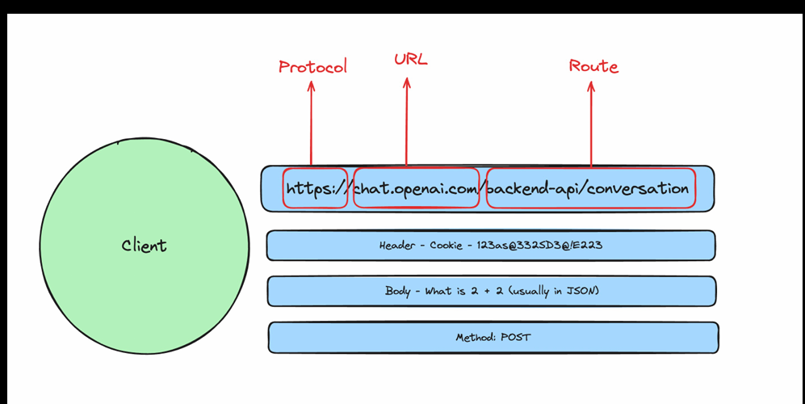
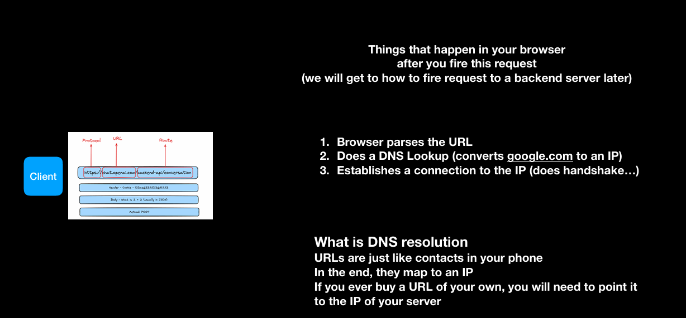

# HTTP Protocol
- Generally client uses URLs to identify resources on the server.
## Things CLIENT needs to worry about when he is sending a request

- Protocol(HTTP/HTTPS) : HTTPS is the secure version of HTTP, using encryption to protect data in transit.
- Address (URL/IP/PORT) of the backend server.
- Route
- Headers, Body, Query Parameters
- Method: Methods like GET, POST, PUT, DELETE
---
## Things that the SERVER needs to worry about
- Response headers
- Response body
- Status codes

## Things which happen in browser

  1. Browser parses the URL 
  2. Does a DNS Lookup (converts google.com to an IP) 
  3. Establishes a connection to the IP (does handshake…) 

### What is DNS resolution?
- DNS (Domain Name Service) resolution is the process of converting a human-readable domain name (like google.com) into an IP address that computers can use to identify each other on the network.