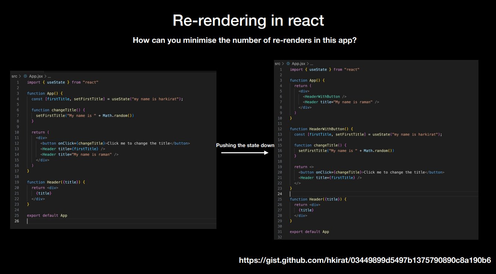

## React component return
- Whenever we are returning something from any react component it should only be a single child, it shouldn't be multiple siblings.
- Inside the top level child, there can be multiple children.
- It is so because it makes it easy to do reconciliation. And makes the rendering process more efficient.
- If we dont want to add an extra div, we can simple return all the children in an empty tag <></> which is called a React Fragment.
- Adding <></> will not add any extra nodes to the DOM and is better for performance.

## Re-rendering in react

- Any time if we update the dom, add or remove elements, react will re-render the component.
- React uses a virtual dom to optimize the rendering process.
- When a component's state or props change, react will re-render that component and its children.
- React will then compare the new virtual dom with the previous one and only update.
- Till now, if we use useState and change the value, the whole component will re-renders, even the static component re renders.
- To avoid this, we can use React.memo which is a higher order component that will only re-render the component if its props change.
  ```jsx
    // Harkirat's way, changing the title
    const [title, setTitle] = useState("my name is ayush");
    function updateTitle() {
      setTitle("my name is " + Math.random());
    }

    return (
      <div>
        <MyHeader name="Ayush" age={age} randomGen={randomGen} />
        <button onClick={updateTitle}>Update the title</button>
        <Header title={title} />
        <Header title="harkirat" />
        <Header title="harkirat" />
        <Header title="harkirat" />
        <Header title="harkirat" />
      </div>
    );
  ```
  - The whole component will re-render, even the static components when we use useState hook to change the contents.
  - Here the state variable comes under the parent `App` component, so when this state variable is changed, it re-renders the whole App 
  component.

## How to fix whole page re-rendering problem?
- There are two ways to fix the whole page from re-rendering:
  1. We push down the state variable where it is being used in specific components.
    
  2. Using React.memo to prevent unnecessary re-renders.
    - Memo is a higher order component that will only re-render the component if its props change.
    - Whenever we define a component which we want to memoize, we can wrap it with React.memo.
    ```jsx
      import React from 'react';

      function Header({title}) {
        console.log("Header rendered");
        return <h1>{title}</h1>;
      }

      const MemoizedHeader = React.memo(Header);

      // OR

      const Footer = React.memo(function ({title}) {
        console.log("Footer rendered");
        return <h1>{title}</h1>;
      })

      export default MemoizedHeader;
    ```