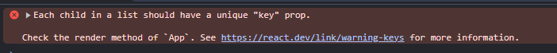

## React component return
- Whenever we are returning something from any react component it should only be a single child, it shouldn't be multiple siblings.
- Inside the top level child, there can be multiple children.
- It is so because it makes it easy to do reconciliation. And makes the rendering process more efficient.
- If we dont want to add an extra div, we can simple return all the children in an empty tag <></> which is called a React Fragment.
- Adding <></> will not add any extra nodes to the DOM and is better for performance.

## Re-rendering in react

- Any time if we update the dom, add or remove elements, react will re-render the component.
- React uses a virtual dom to optimize the rendering process.
- When a component's state or props change, react will re-render that component and its children.
- React will then compare the new virtual dom with the previous one and only update.
- Till now, if we use useState and change the value, the whole component will re-renders, even the static component re renders.
- To avoid this, we can use React.memo which is a higher order component that will only re-render the component if its props change.
```jsx
    // Harkirat's way, changing the title
    const [title, setTitle] = useState("my name is ayush");
    function updateTitle() {
      setTitle("my name is " + Math.random());
    }

    return (
      <div>
        <MyHeader name="Ayush" age={age} randomGen={randomGen} />
        <button onClick={updateTitle}>Update the title</button>
        <Header title={title} />
        <Header title="harkirat" />
        <Header title="harkirat" />
        <Header title="harkirat" />
        <Header title="harkirat" />
      </div>
    );
```
  - The whole component will re-render, even the static components when we use useState hook to change the contents.
  - Here the state variable comes under the parent `App` component, so when this state variable is changed, it re-renders the whole App 
  component.

## How to fix whole page re-rendering problem?
- There are two ways to fix the whole page from re-rendering:
  1. We push down the state variable where it is being used in specific components.
    
  2. Using React.memo to prevent unnecessary re-renders.
    - Memo is a higher order component that will only re-render the component if its props change.
    - Whenever we define a component which we want to memoize, we can wrap it with React.memo.
    ```jsx
      import React from 'react';

      function Header({title}) {
        console.log("Header rendered");
        return <h1>{title}</h1>;
      }

      const MemoizedHeader = React.memo(Header);

      // OR

      const Footer = React.memo(function ({title}) {
        console.log("Footer rendered");
        return <h1>{title}</h1>;
      })

      export default MemoizedHeader;
    ```

## Keys
- Keys are generally used in components to help React identify which items have changed, are added, or are removed.
- Keys should be unique among siblings and stable (i.e., they should not change between renders).
- Using keys improves performance by allowing React to optimize the rendering process.
- If we don't provide a key prop, React will use the array index as the key, which can lead to issues with component state and performance.
  
```jsx
  return (
    <>
      {todo.map(function (item) {
        return <Todo key={item.id} title={item.title} description={item.description} />;
      })}
    </>
  )
```
  - Here we are giving each component a unique key prop based on its id.

## Wrapper Component
- A wrapper component is a component which takes another component as an input.
- It can be used to add additional functionality or styling to the wrapped component.
- Wrapper components are often used for layout purposes, such as creating a grid or flexbox container.
- Example: Create a card wrapper which accepts a component and adds a border and padding.
  ```jsx
  <CardWrapper innerComponent = {<TextComponent />} />
  function CardWrapper({innerComponent}) {
  return <div
      style={{border: "2px solid black", padding: "1rem", borderRadius: "8px"}}
    >
      {innerComponent}
    </div>
  }
  ```
- Other way: We need to pass children as prop only user {}

```jsx
  <CardWrapper2>
    <div>
      Hi from div
    </div>
  </CardWrapper2>

  function CardWrapper2({children}) {
    return <div
      style={{border: "2px solid black", padding: "1rem", borderRadius: "8px", margin: "10px"}}
    >
      {children}
    </div>
  }
```

## Hooks:
- Hooks are functions that let you use state and other React features without writing a class.
- The most commonly used hooks are useState and useEffect.
- Hooks can only be called at the top level of a component or from other custom hooks.
- Hooks generally starts with the word "use".
- Example:
  - `useState`: A hook that lets you add state to your functional components.
  - `useEffect`: A hook that lets you perform side effects in your components or when the component mounts/unmounts.
  ```jsx
    function App() {
      useEffect(function() {
        alert("hi");
      }, []);
      return <div>Hello World</div>;
    }
  ```
  - The hi alert will only be shown once when the component mounts.
  - The empty dependency array means that the effect will only run once when the component mounts, similar to componentDidMount in class components.
    - Dependency array: The second argument to useEffect is an array of dependencies. If any of the dependencies change, the effect will run again.
