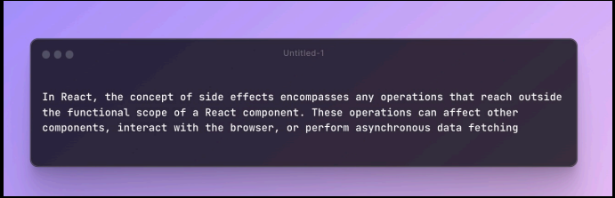

# Side effects:

- Side effects in React are operations that can affect other components or the application state outside of the current component.
- Examples include API calls, subscriptions, and manually changing the DOM.
  1. fetch()
  2. setTimeout
  3. setInterval
- Side effects are typically managed using the `useEffect` hook in functional components.

# Hooks: 
- Hooks are special functions that let you "hook into" React features. They allow you to use state and other React features without writing a class.
- The most commonly used hooks are:
  1. `useState`: Allows you to add state to functional components.
  2. `useEffect`: Lets you perform side effects in function components.
  3. `useContext`: Provides a way to share values between components without having to pass props down manually at every level.
  

### useState:
- The `useState` hook lets you add state to functional components.
- It returns an array with two elements: the current state value and a function to update it.
- You can use it to manage local component state.

### useEffect:
- The `useEffect` hook lets you perform side effects in function components.
- It takes two arguments: a function to run the effect and an array of dependencies.
- The effect function runs after the render is committed to the screen.
- You can use it for data fetching, subscriptions, or manually changing the DOM.
- It serves the same purpose as componentDidMount, componentDidUpdate, and componentWillUnmount in class components which were lifecycle methods in older versions of React.
- Most common usecase - fetching data from an API.
  - We shouldn't fetch backend on every render.
- Dependencies:
  - The array of dependencies lets React know when to re-run the effect.
  - If a value in the array changes, the effect will re-run.
  - If the array is empty, the effect runs only once after the initial render.